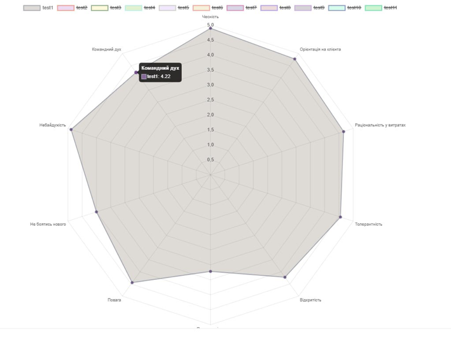

# Data Studio Community Visualization Local Development Template

Data Studio [community visualizations][community viz] allow you to write custom
JavaScript visualizations for [Google Data Studio][datastudio].

## About this template


To start working with the local development process, you will need to install the following:
npm 5.2.0 or later (https://nodejs.org/en/)
gsutil (https://cloud.google.com/storage/docs/gsutil_install)
Create your own project in Cloud Storage Bucket. 
For reference, the two examples above contain detailed information on how to create a bucket.


ALERT/FIX ISSUES:
PERMISSIONS/Access control/Fine-grained: Object-level ACLs enabled
(Command to disable IAM and switch to the old version of ACL.)

Error when running npm run start:
"const components = getBuildableComponents();"
In this case, you need to replace the code in the file
node_modules/@google/dscc-scripts/build/viz/utils.js
with the code from my repository and update the path accordingly.


This template provides

1.  An opinionated workflow for developing community visualizations
1.  A local development workflow with immediate feedback
1.  Scripts to manage building and deploying your visualization

### Files included

To develop your visualization, you should be editing the files in the [./src]
directory.

File       | Template location   | Documentation
---------- | ------------------- | --------------------
Manifest   | `src/manifest.json` | [manifest reference]
Config     | `src/index.json`    | [config reference]
JavaScript | `src/index.js`      | [write viz code]
CSS        | `src/index.css`     | [write css code]

## Using this template

To create a new community visualization based on this template, run the command

```bash
npx @google/dscc-gen viz
```

After running this command (and answering some prompts), you will have a minimal
working visualization and have set GCS buckets for a dev and prod version. Edit
`src/index.js` to see changes.

### Update your local data

1.  Update the dimensions and metrics your visualization requires in
    `src/index.json`
1.  Run the command `npm run update_message` to build and deploy your
    visualization to your "dev" bucket.
1.  [Create a new report][datastudio] and connect to the dataset you want to use
    for your sample message.
1.  Use your "dev bucket" to add this visualization to your report. It will
    display div with the `data` returned by the [ds-component] helper library.
1.  Copy the `data` in the visualization and replace the empty object in
    `src/localData.js`. This is the "local data" that you will develop with.

### Local development workflow

To develop locally:

1.  Change `const LOCAL` to `true` in `src/index.js`.
1.  Run `npm run start` to start a local server. A browser tab should open with
    the visualization you just deployed in Data Studio.
1.  Make changes in `src/index.js` and `src/index.css`, save the changes, and
    see them reflected in the browser tab.

### Deployment workflow

You should have two deployments of your visualization: a "dev" version, where
[caching] is disabled and where you normally develop, and a "prod" version,
where caching is enabled and you only push "finished" visualizations.

To deploy:

1.  Change `const LOCAL` to `false` in `src/index.js`
1.  Run the appropriate build and push command (see below)
1.  Load your viz in Data Studio

### Key commands:

To update the message:

```bash
npm run update_message
```

Note: The message update script uses the `object` format by default. To update
the message with the `table` format, change the `-f` parameter `update_message`
script in `package.json` from `object` to `table`.

Build the "dev" (devMode is true) visualization

```bash
npm run build:dev
```

Deploy the "dev" (devMode is true) visualization

```bash
npm run push:dev
```

Build the "prod" (devMode is false) visualization

```bash
npm run build:prod
```

Deploy the "prod" (devMode is false) visualization

```bash
npm run push:prod
```

## Scripts

The `build` and `deploy` scripts can be found in the `./scripts/bin` directory.

[community viz]: http://developers.google.com/datastudio/visualization
[datastudio]: https://datastudio.google.com
[manifest reference]: https://http://developers.google.com/datastudio/visualization/manifest-reference
[config reference]: https://http://developers.google.com/datastudio/visualization/config-reference
[write viz code]: https://developers.google.com/datastudio/visualization/write-viz
[ds-component]: https://developers.google.com/datastudio/visualization/library-reference
[caching]: https://developers.google.com/datastudio/visualization/caching


Example 

